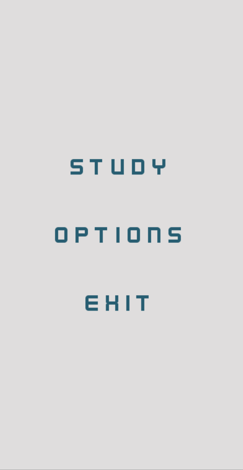

# KANJI VALLEY

A Godot app to study Japanese Kanji. 

<!--  -->

Features:

- JLPT5 Kanji only (for now)
- Check translation and reading
- Automatically converts to Hiragana while typing (in reading scene)

To do:

- Ability to select from all JLPT levels
- Switch between Hiragana and Katakana
- Save and load configuration and settings
- Hints if answer is wrong multiple times in succession

Requirements:  

- kanji.json downloaded from [here](https://github.com/davidluzgouveia/kanji-data)
- Godot addons: Pythonscript version 0.50.0

Credits:

- [Godot](https://godotengine.org/)
- [Kanji data](https://github.com/davidluzgouveia/kanji-data)
- [WanaKana-py](https://github.com/Starwort/wanakana-py)
- [WanaKana](https://github.com/WaniKani/WanaKana)
